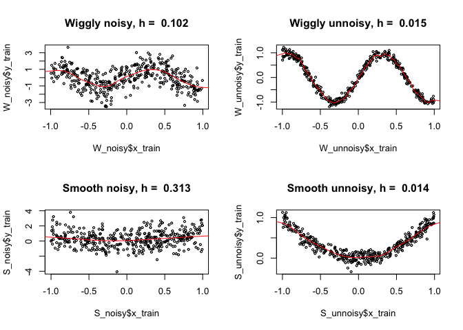

Exercise 3
================
Shuying Wang
3/11/2019

Linear Smoothing
----------------

Data Simulation:
$$x\_i \\stackrel{iid}{\\sim}Uniform(-5,5)\\ \\ \\ \\ \\ \\ \\ y\_i = x\_i^3+\\epsilon\_i\\ \\ \\ \\ \\ \\ \\epsilon\_i\\stackrel{iid}{\\sim}Normal(0, 100)$$

``` r
# Simulate data
N = 500
X <- runif(N, -5, 5)
Y <- X^3 + rnorm(N, 0, 10)
Y = Y - mean(Y)
H = c(0.05, 0.25, 0.5, 1)

# Function for linear smoothing
Linear_smoother <- function(x){
  d = X - rep(x, N)
  w = 1/h * dnorm(d/h, 0, 1)
  w = w/sum(w)
  y = sum(w*Y)
  return(y)
}

# Graph
par(mfrow=c(2, 2))
for (h in H){
  x = matrix(runif(10, -3, 4))
  y = apply(x, 1, Linear_smoother)
  q = Vectorize(Linear_smoother)
  plot(X, Y, cex = 0.5, main = paste("h = ", h))
  curve(q, add = TRUE, col = 'red')
}
```

 We can see from the graph that, when h is small, the model tends to overfit, and when h becomes larger, the curve becomes smoother.

Cross Validation
----------------

Data Simulation:
$$x\_i\\stackrel{iid}{\\sim}Uniform(-1,1)$$
Wiggly function:
*y*<sub>*i*</sub> = *s**i**n*(5*x*<sub>*i*</sub>)+*ϵ*<sub>*i*</sub>
Smooth function:
*y*<sub>*i*</sub> = *x*<sub>*i*</sub><sup>2</sup> + *ϵ*<sub>*i*</sub>
Noisy model:
$$\\epsilon\_i\\stackrel{iid}{\\sim}Normal(0,1)$$
Unnoisy model:
$$\\epsilon\_i\\stackrel{iid}{\\sim}Normal(0,0.01)$$

``` r
# Simulate data
N = 1000 # Size of dataset
n = 800  # Size of training set
X = matrix(runif(4*N, -1, 1), nrow = 4, ncol = N)

Y = matrix(nrow = 4, ncol = N)
Y[1, ] = sin(5*X[1, ]) + rnorm(N, 0, 1)
Y[2, ] = sin(5*X[2, ]) + rnorm(N, 0, 0.1)
Y[3, ] = X[3, ]^2 + rnorm(N, 0, 1)
Y[4, ] = X[4, ]^2 + rnorm(N, 0, 0.1)


# Data of wiggly function
W_noisy = list(x_train = X[1, 1:n], y_train = Y[1, 1:n], x_test = X[1, (n+1):N], y_test = Y[1, (n+1):N])
W_unnoisy = list(x_train = X[2, 1:n], y_train = Y[2, 1:n], x_test = X[2, (n+1):N], y_test = Y[2, (n+1):N]) 

# Data of smooth function
S_noisy = list(x_train = X[3, 1:n], y_train = Y[3, 1:n], x_test = X[3, (n+1):N], y_test = Y[3, (n+1):N])
S_unnoisy = list(x_train = X[4, 1:n], y_train = Y[4, 1:n], x_test = X[4, (n+1):N], y_test = Y[4, (n+1):N])

# Function for linear smoothing
Linear_smoother <- function(h, X_train, Y_train, x_star){
  d = X_train - rep(x_star, n)
  w = 1/h * dnorm(d/h, 0, 1)
  w = w/sum(w)
  y_star = sum(w*Y_train)
  return(y_star)
}

# Function for computing prediction error
Error <- function(Data, h){
  X_train = Data$x_train
  Y_train = Data$y_train
  X_test = Data$x_test
  Y_test = Data$y_test
  Y_predict = sapply(X_test, function(x_star) Linear_smoother(h, X_train, Y_train, x_star))
  error = sum((Y_predict - Y_test)^2)/200
  return(error)
}

# Choose the best bandwidth for each model
par(mfrow = c(2, 2))
H = seq(0.001, 1, 0.001)
x = seq(-5, 5, 0.01)

# Wiggly noisy model
error_Wn = sapply(H, function(h) Error(W_noisy, h))
h_Wn = H[which.min(error_Wn)] # Best bandwidth

plot(W_noisy$x_train, W_noisy$y_train, main = paste('Wiggly noisy, h = ', h_Wn), cex = 0.5)
y = sapply(x, function(x) Linear_smoother(h_Wn, W_noisy$x_train, W_noisy$y_train, x))
lines(x, y, col='red') # curve with best bandwidth

# Wiggly unnoisy model  
error_Wu = sapply(H, function(h) Error(W_unnoisy, h))
h_Wu = H[which.min(error_Wu)]

plot(W_unnoisy$x_train, W_unnoisy$y_train, main = paste('Wiggly unnoisy, h = ', h_Wu), cex = 0.5)
y = sapply(x, function(x) Linear_smoother(h_Wu, W_unnoisy$x_train, W_unnoisy$y_train, x))
lines(x, y, col='red')

# Smooth noisy model
error_Sn = sapply(H, function(h) Error(S_noisy, h))
h_Sn = H[which.min(error_Sn)]

plot(S_noisy$x_train, S_noisy$y_train, main = paste('Smooth noisy, h = ', h_Sn), cex = 0.5)
y = sapply(x, function(x) Linear_smoother(h_Sn, S_noisy$x_train, S_noisy$y_train, x))
lines(x, y, col='red')

# Smooth unnoisy model
error_Su = sapply(H, function(h) Error(S_unnoisy, h))
h_Su = H[which.min(error_Su)]

plot(S_unnoisy$x_train, S_unnoisy$y_train, main = paste('Smooth unnoisy, h = ', h_Su), cex = 0.5)
y = sapply(x, function(x) Linear_smoother(h_Wn, S_unnoisy$x_train, S_unnoisy$y_train, x))
lines(x, y, col='red')
```



Local Polynomial Regression
---------------------------

``` r
# (E)
Data = read.csv("/Users/zhendongwang/Desktop/R/utilities.csv")
Y = Data$gasbill/Data$billingdays
X = Data$temp
N = length(X)

# Functions for local linear regression
S1 <- function(h, X, x){
  d = X - rep(x, N)
  s = sum(dnorm(d/h, 0, 1)*d)
  return(s)
}
S2 <- function(h, X, x){
  d = X - rep(x, N)
  s = sum(dnorm(d/h, 0, 1)*d^2)
  return(s)
}
Weights <- function(h, X, x){
  d = X - rep(x, N)
  w = dnorm(d/h, 0, 1)*(S2(h,X,x) - d*S1(h,X,x))
  w = w / sum(w)
  return(w)
}
Prediction <- function(h, X, Y, x){
  y = t(Weights(h, X, x)) %*% Y
  return(y)
}

# Leave one out cross validation
Head <- function(h, X){
  H = sapply(X, function(x) Weights(h, X, x))
  return(H)
}
LOOCV <- function(h, X, Y){
  H = Head(h, X)
  error = 0
  for (i in 1:N){
    error = error + ((Y[i] - Prediction(h, X, Y, X[i]))/(1-H[i, i]))^2
  }
  error = error / N
  return(error)
}
par(mfrow = c(1, 2))
bandwidth = seq(0.01, 10, 0.01)
Error = sapply(bandwidth, function(h) LOOCV(h, X, Y))
plot(bandwidth, Error, cex = 0.5, main = 'Error with different bandwidth')
h_best = bandwidth[which.min(Error)]

plot(X, Y, main = paste('Local linear, h = ', h_best), cex = 0.7)
x = seq(9, 78, 0.1)
y = sapply(x, function(x) Prediction(h_best, X, Y, x))
lines(x, y, col='red')

# (F)
library(psych)
```

    ## Warning: package 'psych' was built under R version 3.5.2


``` r
residual = Y - t(Head(h_best, X)) %*% Y
plot(X, residual, cex = 0.7, main = 'Residuals')
H = Head(h_best, X)
sigma_hat = (sum(residual^2) / (N - 2*tr(H) + tr(t(H)%*%H)))^0.5

# (G)
low_bound = c()
up_bound = c()
X_s = sort(X)
for (i in 1:N){
  w = Weights(h_best, X, X_s[i])
  y_hat = sum(w*Y)
  l = 1.96 * sigma_hat * sum(w^2)^0.5
  low_bound[i] = y_hat - l
  up_bound[i] = y_hat + l
}

plot(X, Y, main = paste('Local linear, h = ', h_best), cex = 0.7)
lines(x, y, col='red')
polygon(x = c(X_s, rev(X_s)), y = c(low_bound, rev(up_bound)), col = rgb(0.1, 0.1, 0.1, 0.2), border=NA)
```


